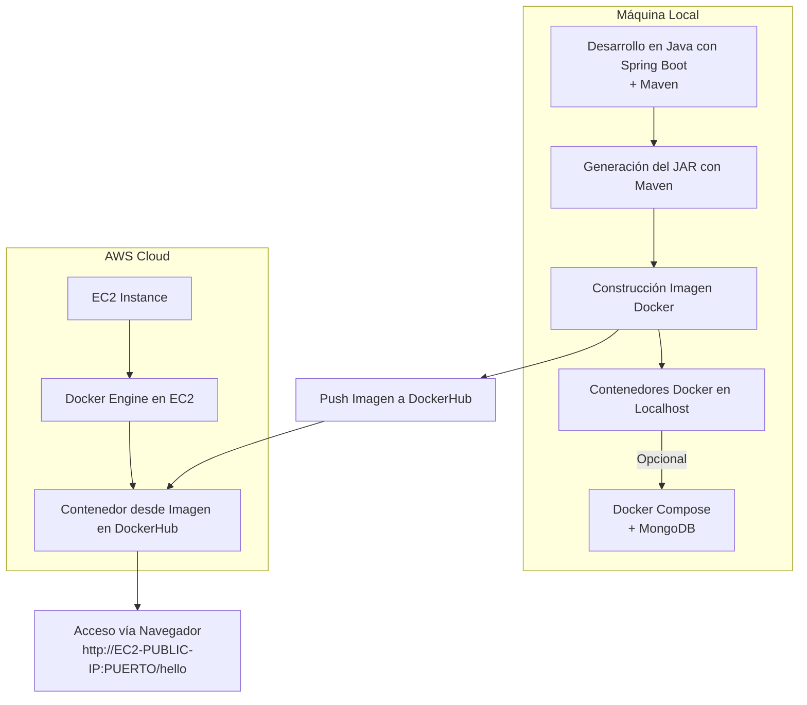

# Taller 4: Virtualización con Docker y AWS

[](https://www.oracle.com/java/)
[](https://maven.apache.org/)


## Descripción

En este taller profundizamos los conceptos de modulación por medio de virtualización usando Docker y AWS.


Para este taller necesitamos la aplicación web pequeña que creamos en los talleres pasados, que usa SPRING. Una vez tengamos esta aplicación procederemos a construir un container para docker para la aplicación y los desplegaremos y configuraremos en nuestra máquina local. Luego, crearemos un repositorio en DockerHub y subiremos la imagen al repositorio. Finalmente, crearemos una máquina virtual de en AWS, instalaremos Docker , y desplegaremos el contenedor que acabamos de crear.

## Estructura de archivos del proyecto

```bash
.
├── .gitignore                  # Archivos y carpetas ignorados por git
├── docker-compose.yml           # Configuración de servicios Docker (app y base de datos)
├── Dockerfile                   # Instrucciones para construir la imagen Docker de la app
├── pom.xml                      # Configuración de Maven (dependencias y build)
├── README.md                    # Documentación del proyecto
├── public/                      # Archivos estáticos accesibles desde el navegador
│   ├── app.js                   # Lógica del lado del cliente en JavaScript
│   ├── clase.html               # Página web sencilla hecha en clase
│   ├── index.html               # Página principal de la aplicación
│   ├── styles.css               # Hojas de estilo para la interfaz
│   └── images/                  # Imágenes usadas en la aplicación y el README
├── src/                         # Código fuente y pruebas
│   └── main/
│       └── java/
│           └── co/
│               └── edu/
│                   └── escuelaing/
│                       ├── httpserver/           # Implementación del servidor HTTP propio
│                       │   ├── HttpServer.java   # Clase principal del servidor
│                       │   ├── HttpRequest.java  # Encapsula la solicitud HTTP
│                       │   ├── HttpResponse.java # Encapsula la respuesta HTTP
│                       │   ├── Methods.java      # Métodos auxiliares
│                       │   └── Service.java      # Interfaz para servicios
│                       └── microspringboot/      # Framework propio tipo Spring
│                           ├── MicroSpringBoot.java # Main launcher del framework
│                           ├── annotations/         # Anotaciones personalizadas
│                           │   ├── GetMapping.java
│                           │   ├── PostMapping.java
│                           │   ├── RequestParam.java
│                           │   └── RestController.java
│                           └── examples/            # Controladores de ejemplo
│                               ├── ClaseController.java
│                               └── GreetingController.java
├── target/                     # Archivos compilados y empaquetados (generado por Maven)
```

## Diagrama de arquitectura


## Ejecutando el proyecto

### Pre-requisitos

Para ejecutar este proyecto necesitas instalar lo siguiente:

- Java 17 o superior
- Maven 3.8.1 o superior (la versión en el entorno donde fue creado es la 3.9.9)
- Un navegador web
  
En caso de no tener maven instalado, aquí se encuentra un tutorial [Instalación de Maven](https://es.stackoverflow.com/questions/65317/como-instalar-maven-en-windows). 

### Instalación

Siga estos pasos para obtener un entorno de desarrollo funcional:

Clone este repositorio:

```bash
git clone https://github.com/Juan-Jose-D/Taller4-AREP
```

Ingrese al directorio del proyecto:

```bash
cd Taller4-AREP
```

Compile el proyecto con Maven:

```bash
mvn clean compile
```

Y ejecute el servidor:

```bash
java -cp target/classes co.edu.escuelaing.microspringboot.MicroSpringBoot
```


Abra su navegador y acceda a alguna de las rutas:

```bash
# Endpoints por anotaciones
http://localhost:35000/hello?name=Juan
http://localhost:35000/greeting?name=Juan
http://localhost:35000/pi

# Páginas estáticas
http://localhost:35000/index.html
http://localhost:35000/clase.html
```

### 3. Construir la imagen Docker

En la raíz del proyecto, construya la imagen:

```sh
docker build -t arep-taller4 .
```

### 4. Ejecutar con Docker Compose

Levante los servicios definidos en `docker-compose.yml`:

```sh
docker-compose up -d
```

Esto crea el contenedor de la aplicación y una instancia de MongoDB.

### 5. Subir la imagen a DockerHub

1. Cree un repositorio en DockerHub.
2. Etiquete la imagen:
   ```sh
   docker tag arep-taller4 <usuario_dockerhub>/arep-taller4:latest
   ```
3. Inicie sesión y suba la imagen:
   ```sh
   docker login
   docker push <usuario_dockerhub>/arep-taller4:latest
   ```

### 6. Desplegar en AWS EC2

1. Inicie una máquina virtual EC2.
2. Instale Docker:
   ```sh
   sudo yum update -y
   sudo yum install docker
   sudo service docker start
   sudo usermod -a -G docker ec2-user
   ```
3. Cierre sesión y vuelva a ingresar para aplicar los permisos.
4. Ejecute el contenedor usando la imagen subida:
   ```sh
   docker run -d -p 42000:6000 --name taller4aws <usuario_dockerhub>/arep-taller4:latest
   ```
5. Abra el puerto en el Security Group de la instancia EC2.
6. Acceda a la aplicación desde el navegador usando la URL pública de la instancia EC2.


---

**Autor:** Juan José Díaz