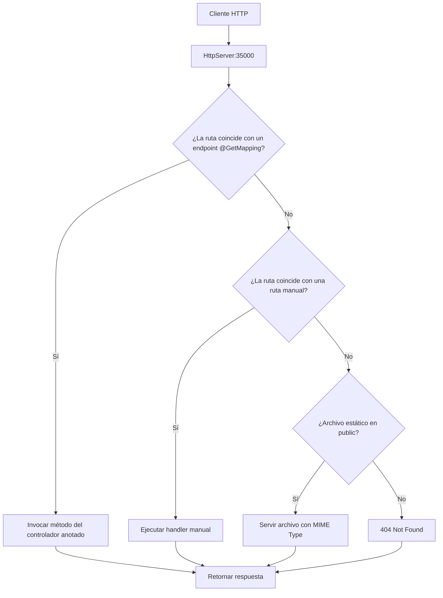

# Arquitecturas empresariales - Taller 3: MicroSpringBoot

[](https://www.oracle.com/java/)
[](https://maven.apache.org/)


Este proyecto implementa un mini-framework tipo Spring Boot llamado **MicroSpringBoot**, que permite construir aplicaciones web en Java usando anotaciones para definir controladores, rutas y parámetros. El servidor es capaz de servir páginas HTML, imágenes, recursos estáticos y exponer servicios REST a partir de POJOs anotados. 

El framework incluye:
- Un sistema de anotaciones propio (`@RestController`, `@GetMapping`, `@RequestParam`).
- Un servidor HTTP que detecta y registra automáticamente los controladores.
- Soporte para archivos estáticos desde la carpeta `public`.
- Ejemplo de aplicación web y endpoints REST.

---


## Características Principales

1. **Framework IoC y Anotaciones Propias**
Usa anotaciones para definir controladores y rutas:
    - `@RestController`: Marca una clase como controlador REST.
    - `@GetMapping("/ruta")`: Expone un método como endpoint HTTP GET.
    - `@RequestParam`: Permite mapear parámetros de la URL a argumentos del método.
    - `@PostMapping("/ruta")`: Expone un método como endpoint POST. 

1. **Carga automática de POJOs y controladores**
El framework detecta automáticamente las clases anotadas y las expone como endpoints.

1. **Soporte para archivos estáticos**
Sirve archivos HTML, CSS, JS, imágenes, etc. desde la carpeta `public`.

1. **Fácil extensión y creación de endpoints**
Solo necesitas crear una clase anotada y métodos con las anotaciones adecuadas.

1. **Manejo de parámetros de consulta y valores por defecto**
Los métodos pueden recibir parámetros de la URL y valores por defecto usando `@RequestParam`.

1. **POJOs y lógica de negocio**
Puedes crear tus propios POJOs y usarlos en los controladores para exponer lógica de negocio o datos.

---


## Arquitectura y funcionamiento

El núcleo es la clase `HttpServer`, que implementa el servidor HTTP y el sistema de anotaciones. El framework detecta automáticamente los controladores y expone los métodos anotados como endpoints HTTP.

### Anotaciones disponibles

- `@RestController`: Marca una clase como controlador REST.
- `@GetMapping("/ruta")`: Expone un método como endpoint GET.
- `@PostMapping("/ruta")`: Expone un método como endpoint POST. El método debe ser `public static` y recibir un solo argumento tipo `String` (el body de la solicitud).
- `@RequestParam(value = "param", defaultValue = "valor")`: Mapea parámetros de la URL a argumentos del método.


### Ejemplo de controlador

```java
@RestController
public class GreetingController {
  @GetMapping("/greeting")
  public static String greeting(@RequestParam(value = "name", defaultValue = "World") String name) {
    return "Hola " + name;
  }
}
```

```java
@PostMapping("/api/components")
    public static String addComponentApiPost(String body) {
        System.out.println("POST recibido: " + body);
        String name = extractJsonValue(body, "name");
        String type = extractJsonValue(body, "type");
        String description = extractJsonValue(body, "description");
        String rating = extractJsonValue(body, "rating");
        String comp = String.format("%s|%s|%s|%s", name, type, description, rating);
        componentes.add(comp);
        return "{\"status\":\"OK\"}";
    }
```

```java
@GetMapping("/hello")
    public static String hello(@RequestParam(value = "name", defaultValue = "World") String name) {
        return "Hola " + name;
    }
```

### Ejemplo de POJO

```java
public class Component {
  private String name;
  private String type;
  // ...constructores, getters, setters...
}
```

Puedes usar POJOs en tus controladores para lógica de negocio, almacenamiento en memoria, etc.

### Cómo agregar un nuevo endpoint

1. Crea una clase en `src/main/java/co/edu/escuelaing/microspringboot/examples/` (o cualquier paquete).
2. Anótala con `@RestController`.
3. Agrega métodos públicos y estáticos anotados con `@GetMapping`.
4. Usa `@RequestParam` para recibir parámetros de la URL.

### Cómo agregar una nueva página

1. Coloca tu archivo HTML, JS, CSS o imagen en la carpeta `public/`.
2. Accede a él desde el navegador: `http://localhost:35000/tuarchivo.html`.

### Estructura General

- **Definición de rutas REST:**
  Se utiliza el método `get(String path, RouteHandler handler)` para mapear rutas a funciones lambda que procesan las solicitudes.

- **Manejo de parámetros de consulta:**
  Los parámetros de la URL se extraen automáticamente y se pueden acceder desde el objeto `Request` dentro de cada handler.

- **Archivos estáticos:**
  El método `staticfiles(String folder)` permite especificar la carpeta raíz de los archivos estáticos.


### Flujo de Procesamiento de Solicitudes



---

## Estructura de archivos del proyecto

```bash
.
├── .mvn/                    # Configuración de Maven Wrapper
├── public/                  # Archivos estáticos accesibles desde el navegador
│   ├── images/              # Carpeta con imágenes usadas en la aplicación y en el readme 
│   ├── app.js               # Lógica del lado del cliente en JavaScript
│   ├── index.html           # Página principal de la aplicación
│   ├── clase.html           # Página web sencilla hecha en clase
│   └── styles.css           # Hojas de estilo para dar diseño a la interfaz           
├── src/                     # Código fuente y pruebas
│   ├── main/                # Código principal
│   │   └── java/
│   │       └── co/
│   │           └── edu/
│   │               └── escuelaing/
│   │                   ├── httpserver/
│   │                   │   ├── HttpServer.java   # Clase principal del servidor
│   │                   │   ├── HttpRequest.java  # Encapsula la solicitud HTTP
│   │                   │   ├── HttpResponse.java # Placeholder para respuesta
│   │                   │   └── ...
│   │                   ├── microspringboot/
│   │                   │   ├── MicroSpringBoot.java # Main launcher
│   │                   │   ├── annotations/         # Anotaciones propias
│   │                   │   │   ├── RestController.java
│   │                   │   │   ├── GetMapping.java
│   │                   │   │   └── RequestParam.java
│   │                   │   └── examples/
│   │                   │       ├── ClaseController.java    # Ejemplo de controlador
│   │                   │       ├── GreetingController.java # Ejemplo de controlador
│   │                   │       └── ...
│   │                   └── Component.java # Clase modelo para representar un componente, usada en index.html
│   └── test/                     # Código de pruebas unitarias
├── target/                       # Archivos compilados y empaquetados (generado por Maven)
├── pom.xml                       # Configuración de Maven (dependencias y build)
└── README.md
```

---


## Capturas de pantalla

Si vamos a la url http://localhost:35000/index.html vemos la aplicación web creada para el taller 1, es una lista para tener los libros, películas y series que el usuario haya visto y quiera guardar para futuros recuerdos, puede añadir una descripción y una calificación.

Este archivo se modificó para que pueda enviar solicitudes POST con JSON a `/api/components` haciendo uso de nuestro framework microspringboot y recibir respuestas inmediatas, permitiendo una experiencia SPA moderna.


Si vamos a la url http://localhost:35000/clase.html vemos la página web hecha en clase, la primera simplemente imprime "Hello" y el nombre que se ponga, y la segunda imprime el número pi, estos endpoints fueron creados usando funciones lambda.

Esto también se modificó para que use nuestro microspringboot


---


## Ejecutando el proyecto

Estas instrucciones permiten obtener una copia del proyecto en funcionamiento en la máquina local para desarrollo y pruebas.


### Pre-requisitos

Para ejecutar este proyecto necesitas instalar lo siguiente:

- Java 17 o superior
- Maven 3.8.1 o superior (la versión en el entorno donde fue creado es la 3.9.9)
- Un navegador web
  
En caso de no tener maven instalado, aquí se encuentra un tutorial [Instalación de Maven](https://es.stackoverflow.com/questions/65317/como-instalar-maven-en-windows). 

### Instalación

Siga estos pasos para obtener un entorno de desarrollo funcional:

Clone este repositorio:

```bash
git clone https://github.com/Juan-Jose-D/Taller3-AREP.git
```

Ingrese al directorio del proyecto:

```bash
cd Taller3-AREP
```

Compile el proyecto con Maven:

```bash
mvn clean compile
```

Y ejecute el servidor:

```bash
java -cp target/classes co.edu.escuelaing.microspringboot.MicroSpringBoot
```
El framework detectará automáticamente todas las clases anotadas con `@RestController` en el classpath y expondrá sus métodos anotados como endpoints, sin necesidad de especificarlas en la línea de comandos.


Abra su navegador y acceda a alguna de las rutas:

```bash
# Endpoints por anotaciones
http://localhost:35000/hello?name=Juan
http://localhost:35000/greeting?name=Juan
http://localhost:35000/pi

# Páginas estáticas
http://localhost:35000/index.html
http://localhost:35000/clase.html
```

---


## Pruebas y desarrollo

Para ejecutar las pruebas automatizadas use este comando de maven:

```bash
mvn test
```

Resultados esperados:

```bash
[INFO] -------------------------------------------------------
[INFO]  T E S T S
[INFO] -------------------------------------------------------
[INFO] Running com.arep.ComponentTest
[INFO] Tests run: 2, Failures: 0, Errors: 0, Skipped: 0, 
Time elapsed: 0.052 s -- in com.arep.ComponentTest
[INFO] Running com.arep.HttpServerIntegrationTest
[INFO] Tests run: 2, Failures: 0, Errors: 0, Skipped: 0, 
Time elapsed: 0.504 s -- in com.arep.HttpServerIntegrationTest
[INFO] Running com.arep.HttpServerTest
[INFO] Tests run: 4, Failures: 0, Errors: 0, Skipped: 0, 
Time elapsed: 0.009 s -- in com.arep.HttpServerTest
[INFO] 
[INFO] Results:
[INFO]
[INFO] Tests run: 8, Failures: 0, Errors: 0, Skipped: 0
[INFO]
[INFO] --------------------------------------------------------
[INFO] BUILD SUCCESS
[INFO] --------------------------------------------------------
[INFO] Total time:  2.589 s
[INFO] Finished at: 2025-08-18T22:07:40-05:00
[INFO] --------------------------------------------------------
```

---


## Despliegue y extensión

Para desplegar este servidor en un sistema en producción.

Empaquete el proyecto en un JAR ejecutable:

```bash
mvn clean package
```

Ejecute el JAR generado:

```bash
java -jar target/MicroSpringboot-1.0-SNAPSHOT.jar
```

---


## Herramientas y tecnologías usadas

- Java SE – Lenguaje de programación orientado a objetos para aplicaciones de propósito general.
- Maven – Herramienta de gestión de dependencias y automatización de la construcción de proyectos Java.
- HTML5 – Lenguaje de marcado estándar para estructurar el contenido de páginas web.
- JavaScript – Lenguaje de programación que permite crear interactividad y lógica en aplicaciones web del lado del cliente (y también del servidor con Node.js).
- CSS – Lenguaje de estilos que define la presentación y diseño visual de documentos HTML.

---


## Autor y créditos

Juan José Díaz - [github](https://github.com/Juan-Jose-D)

Escuela Colombiana de ingeniería Julio Garavito


